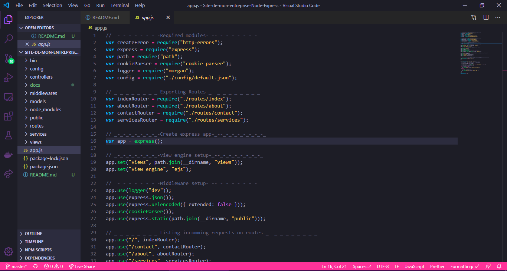
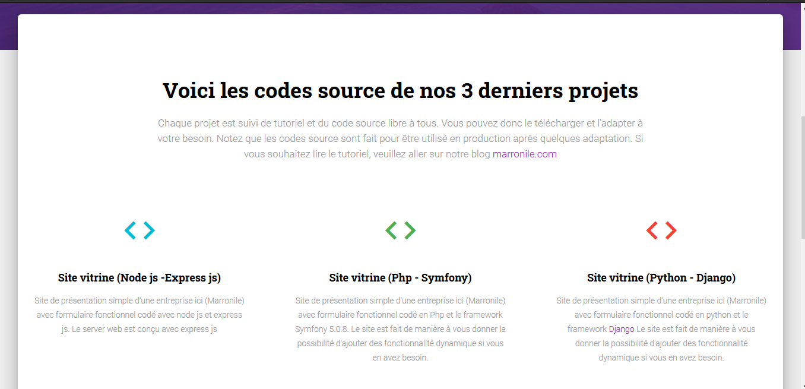
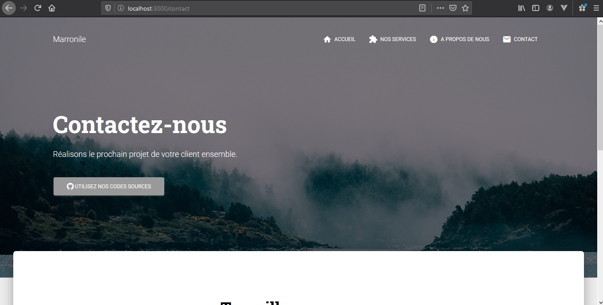
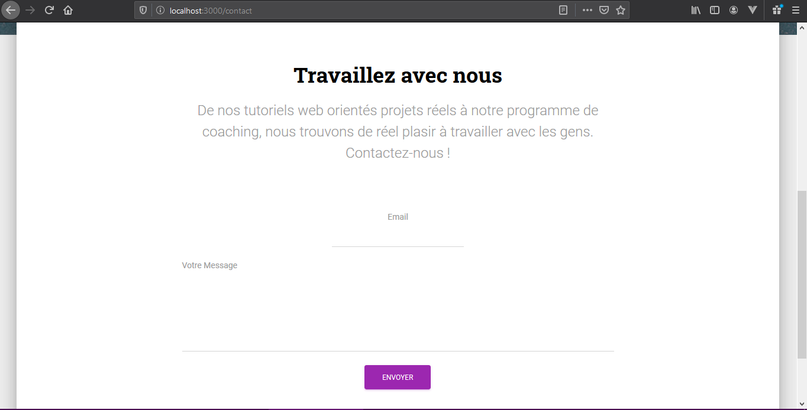
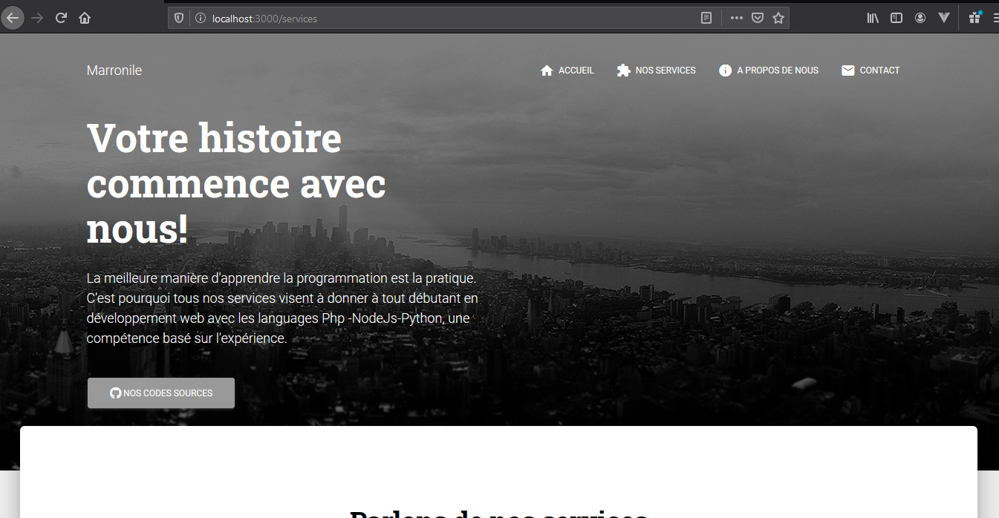
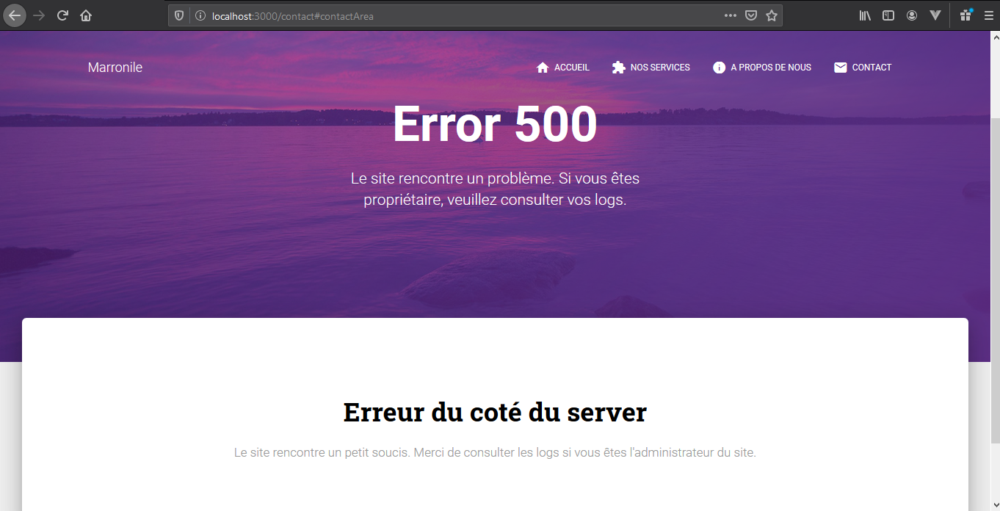

# Site-de-mon-entreprise-Node-Express

  

Nous allons réaliser le site de l'entreprise Marronile Sarl pour lui permettre:

- de présenter ses activités
- et donner la possibilité aux clients de le contacter

Le site aura un backend node js et doit être être extensible facilement.

## Features

Dans la description du projet, nous voyons apparaître clairement les fonctionnalités que nous devrons coder. Ainsi, nous réaliseront les pages suivantes:

- Accueil: Page d'accueil du site qui présentera les derniers tutoriels de projets réels

- A propos: Page sur laquelle nous allons présenter l'entreprise, sa vision et sa mission

  

  

- Contact: Page de contact par email.

  

  

- Nos services: Page de présentation des services de l'entreprise

  

  

- Not found page
- Server Error page

  

  

## Prerequisites

- Node js installé
- Le ClI de Express Js installé

## Can i use it in production ?

Oui, vous pouvez l'utiliser ce projet en production gratuitement. Mais assurez-vous de:

- Modifier les variables de configuration dans le repertoire /config
- De modifier le services d'envoi de mail selon le services de transport de mail que vous désirez
  /services/mailer.services.js
- Modifier les pages /views/

## Tutorial

Checkout the written tutorial from [marronile.com](https://www.marronile.com/)

## About templates

This project use the free version, MIT licensed template material-kit of [Creative-tim](https://www.creative-tim.com/).
