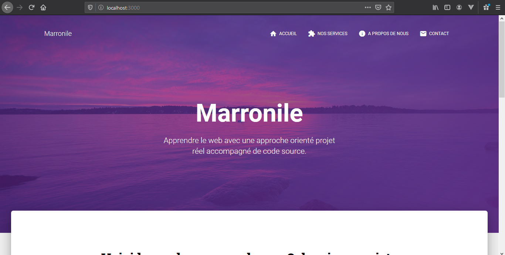

# Site-de-mon-entreprise-Node-Express

  

We are going to create the site of the company Marronile Sarl to allow it:

- to present its activities
- and give customers the opportunity to contact him

The site will have a node js backend and must be easily expandable.

## Features

In the description of the project, we see clearly the functionalities that we will have to code. Thus, we will realize the following pages:

- Home: Home page of the site which will present the latest tutorials of real projects

- About: Page on which we will present the company, its vision and its mission
- Contact: Contact page by email.
- Our services: Presentation page of the company's services
- Not found page
- Server Error page

## Demonstration

Go to this address to see a demonstration of the site:

## Prerequisites

- Node js installed
- The Express Js ClI installed

## Can i use it in production?

Yes, you can use this project in production for free. But be sure to:

- Modify the configuration variables in the / config directory
- To modify the mail sending services according to the mail transport services you want
  /services/mailer.services.js
- Edit pages / views /

## Tutorial

Checkout the written tutorial from [marronile.com](https://www.marronile.com/projet-reel-creer-le-site-de-mon-entreprise-avec-node-js-et-express-js/)

## About templates

This project use the free version, MIT licensed template material-kit of [Creative-tim](https://www.creative-tim.com/).
